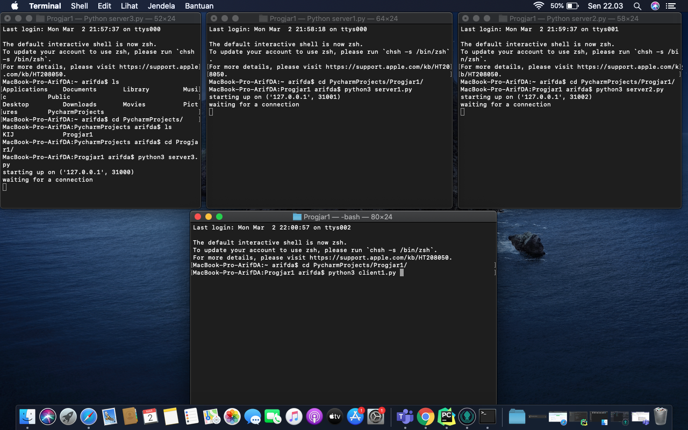
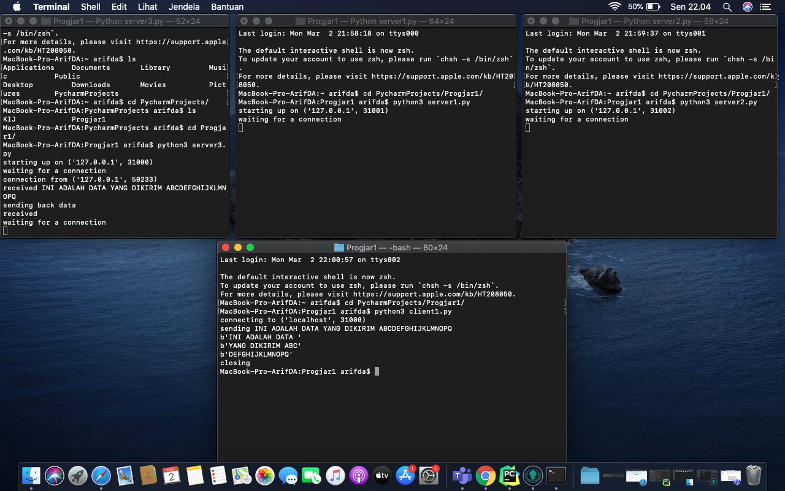
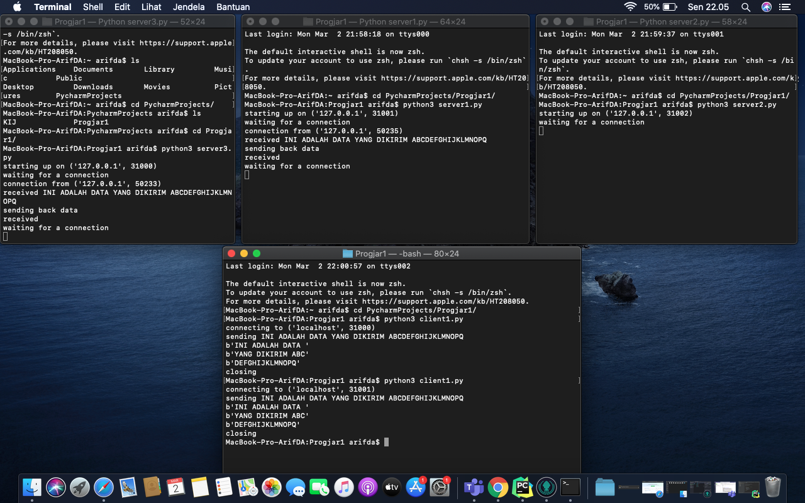
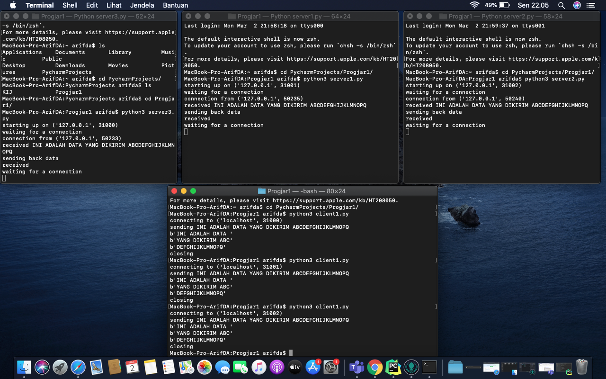
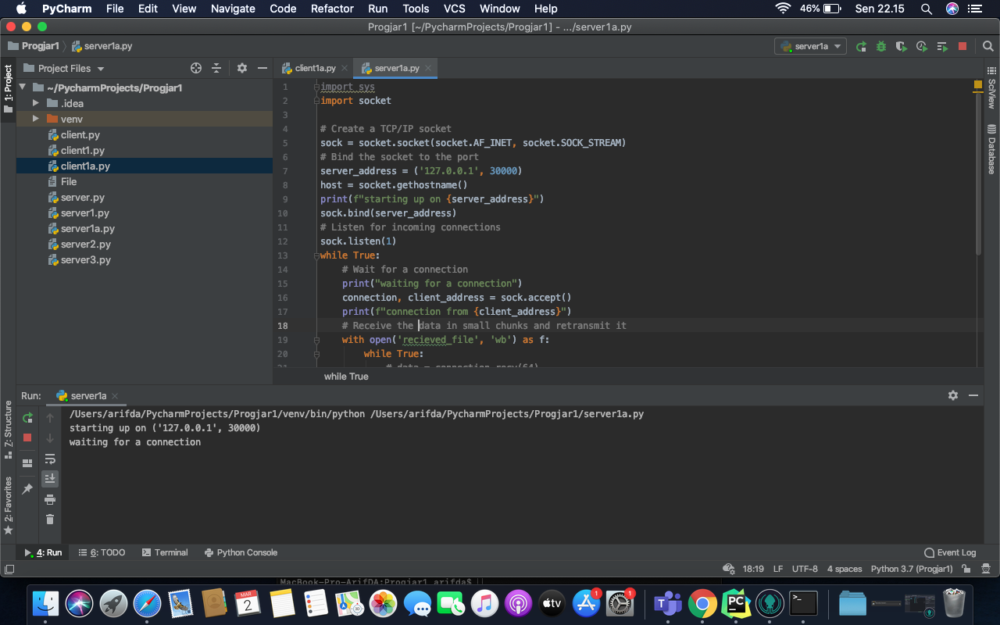
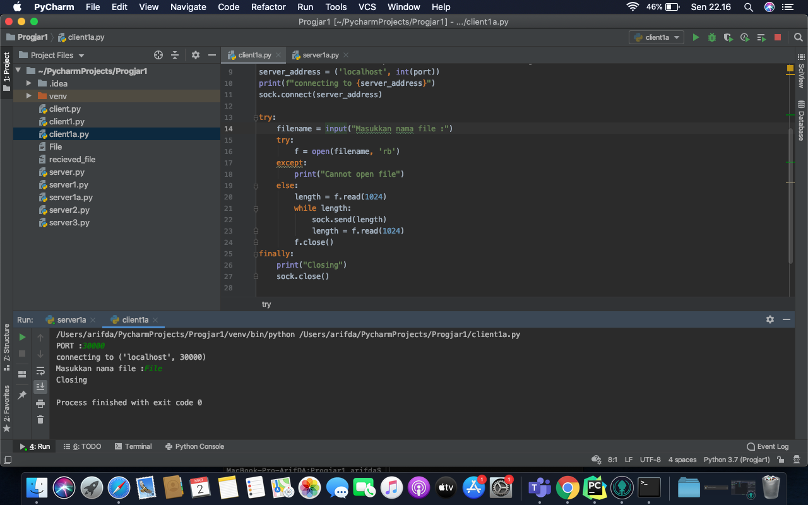
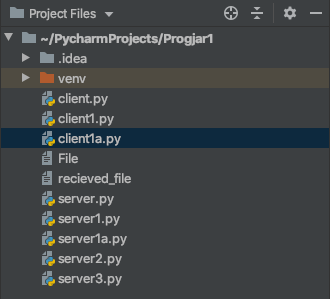
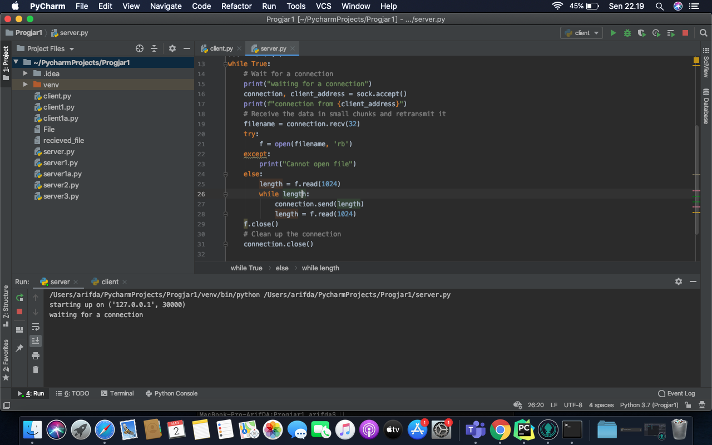
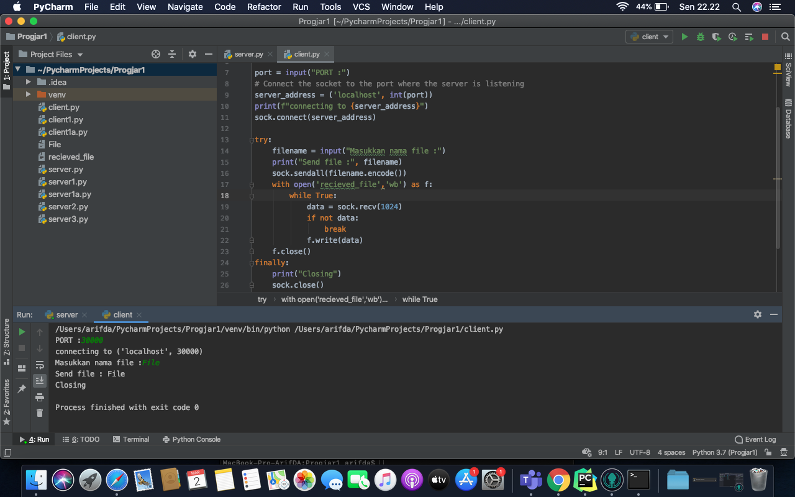
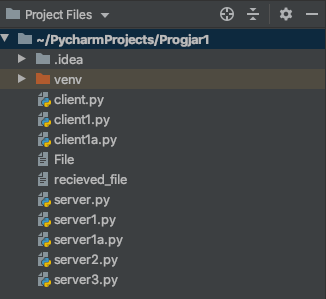

# Tugas 1
### Server dijalankan di 3 server yang berbeda, masing-masing client connect ke server tersebut
Kondisi awal server dengan port 3100,3101,3102 menyala

Client mengirimkan pesan ke server port 3100

Client mengirimkan pesan ke server port 3101

Client mengirimkan pesan ke server port 3102

### Server dijalankan, client mencoba untuk mengirimkan file
Kondisi awal server

Client mengirimkan file ke server

Server setelah mendapatkan kiriman file

### Server dijalankan di komputer saya, client request file untuk dikirimkan dari server
Kondisi awal server 
 

Client meminta dan mendapatkan file dengan nama *File*

Client berhasil mendapatkan file 

