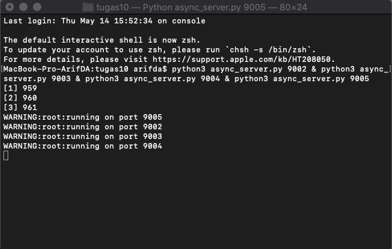
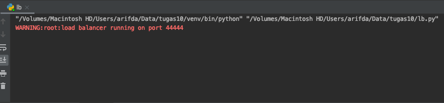
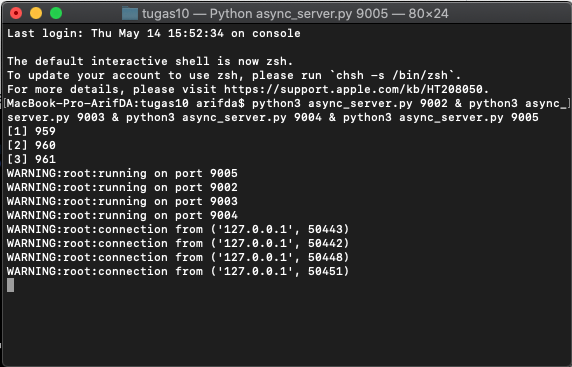
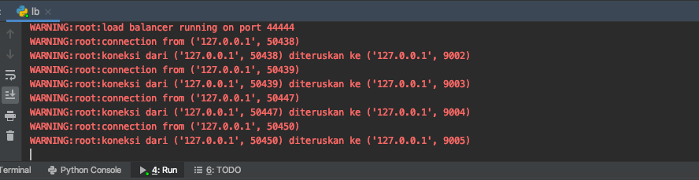
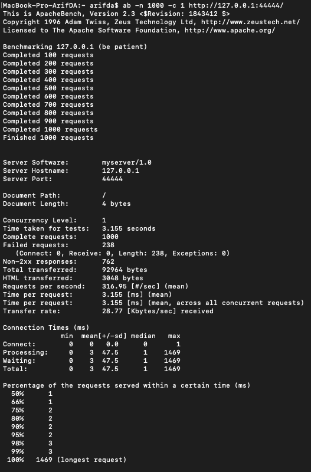
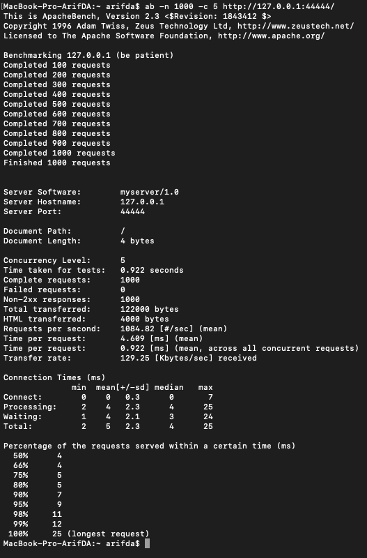
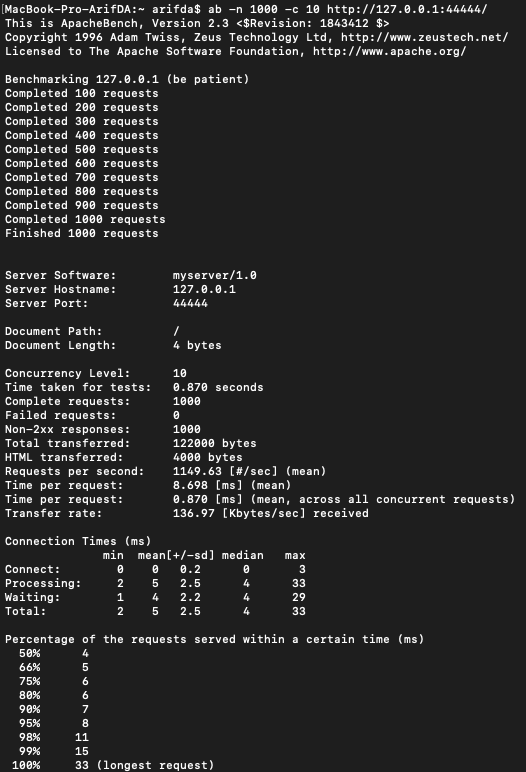
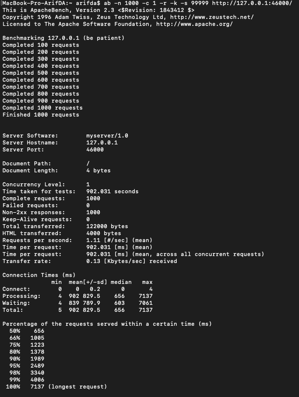
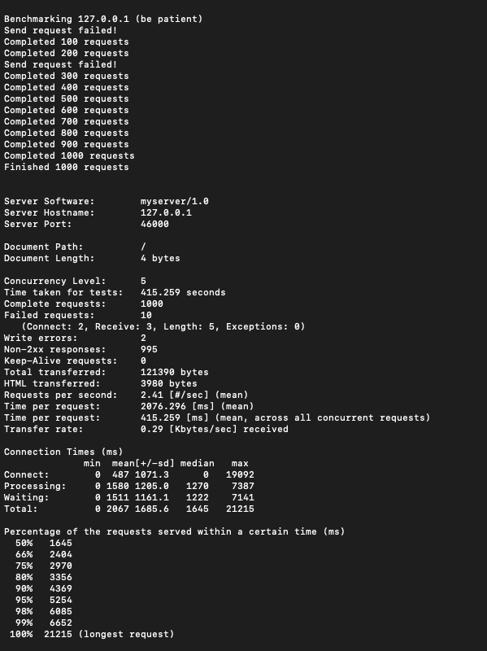

# Tugas 10

- Jalankan `async_server.py` pada port 9002, 9003, 9004, 9005  
  
- Jalankan file `lb.py`, jalankan di port 44444  
  
- Jalankan browser, akseslah `http://localhost:44444/page.html`  
  
- Lihatlah di log program, bahwa setiap request akan dilayani oleh backend yang bergantian  
  
  
- Lakukan performance test, bandingkan penggunaan __load balancer__  
  - Server Async 
  
  
  
  - Thread Server 
  
  
- Tabel hasil ujicoba
  - [Async_server.py](../tugas10/async_server.py)  
    | No test | Concurrency level | Time taken for test (seconds) | Complete request | Failed request | Total transferred (bytes) | Request per second | Time per request (ms) | Transfer rate (Kbytes/sec) |
    |---------|-------------------|-------------------------------|------------------|----------------|---------------------------|--------------------|-----------------------|----------------------------|
    | 1       | 1                 | 3.155                         | 1000             | 238              | 92964                    | 316.95            | 3.155                 | 28.77                     |
    | 2       | 5                 | 0.922                         | 1000             | 0              | 122000                    | 1084.82            | 4.609                 | 129.25                     |
    | 3       | 10                | 0.870                         | 1000             | 0              | 122000                    | 1149.63            | 8.698                 | 136.97                     |
  - [Server_thread_http.py](../tugas9/server_thread_http.py)  
    | No test | Concurrency level | Time taken for test (seconds) | Complete request | Failed request | Total transferred (bytes) | Request per second | Time per request (ms) | Transfer rate (Kbytes/sec) |
    |---------|-------------------|-------------------------------|------------------|----------------|---------------------------|--------------------|-----------------------|----------------------------|
    | 1       | 1                 | 902.031                       | 1000             | 0              | 122000                    | 1.11               | 902.031               | 0.13                       |
    | 2       | 5                 | 415.259                       | 1000             | 10              | 121390                    | 2.41               | 2076.296               | 0.29                       |
