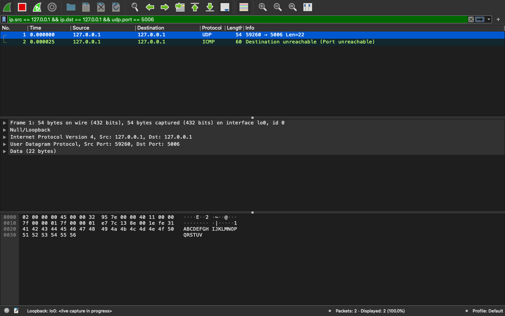
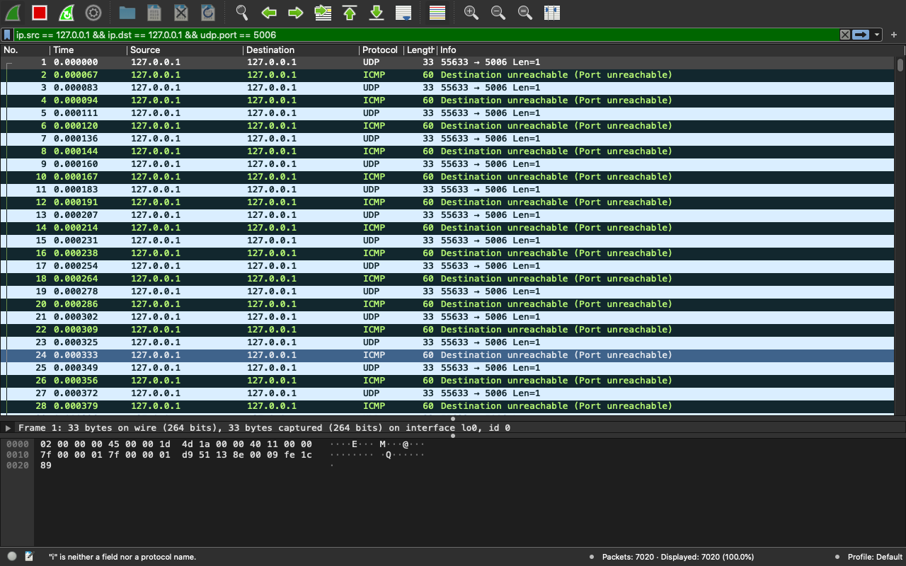
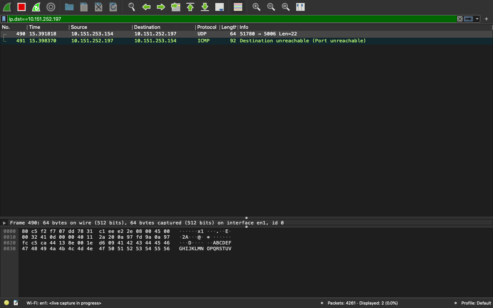
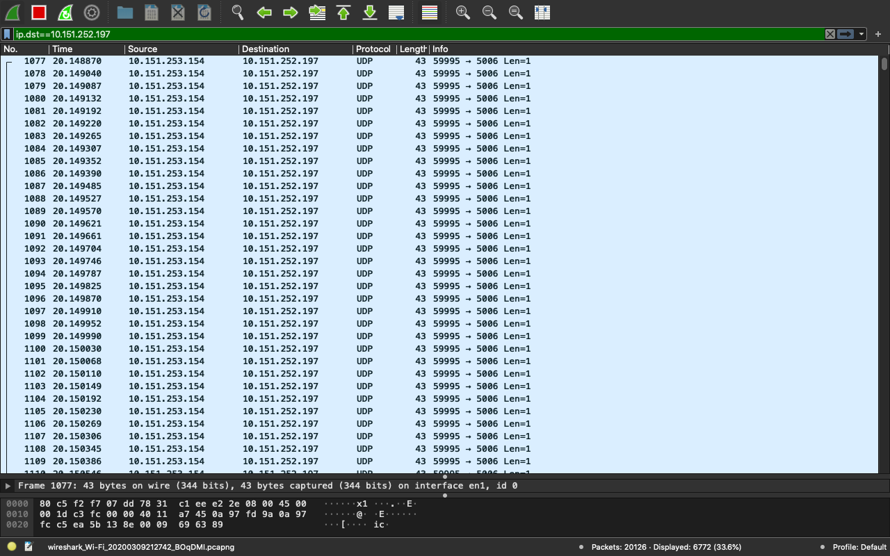

# Tugas 2

### Menjalankan udp_simple dari pc saya(ip=127.0.0.1) ke localhost (127.0.0.1) dengan port 5006.
Pesan yang dikirmkankan adalah *ABCDEFGHIJKLMNOPQRSTUV*

### Menjalankan udpfileclient dari pc saya(ip=127.0.0.1) ke localhost (127.0.0.1) dengan port 5006.
File yang dikirimkan adalah *bart.png*

### Menjalankan udp_simple dari pc saya(ip=10.151.253.154) ke pc lain (10.151.252.197) dengan port 5006.
Pesan yang dikirmkankan adalah *ABCDEFGHIJKLMNOPQRSTUV*

### Menjalankan udpfileclient dari pc saya(ip=10.151.253.154) ke pc lain (10.151.252.197) dengan port 5006.
File yang dikirimkan adalah *bart.png*

