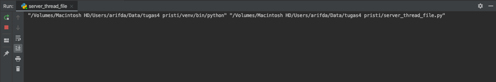
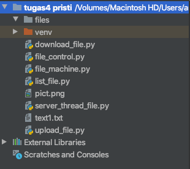
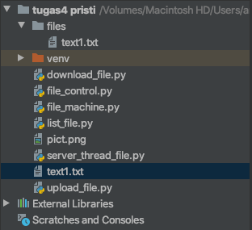
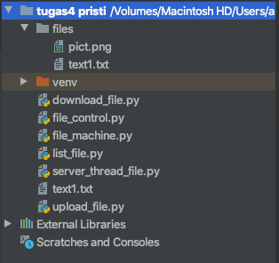
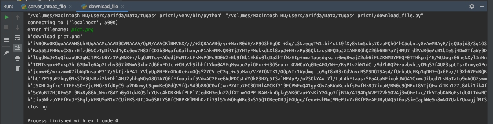
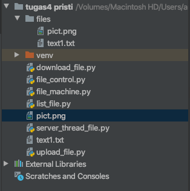
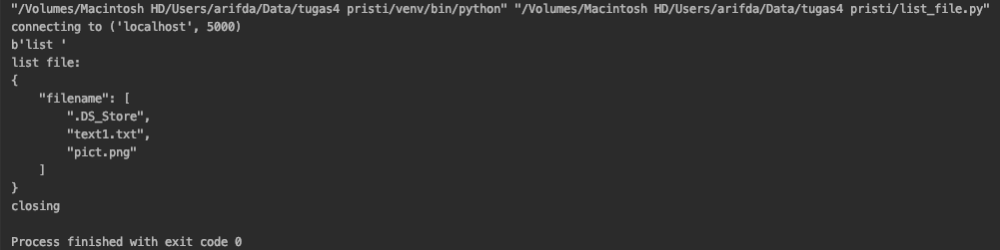

# Tugas 4

- Protokol untuk **meletakkan file**  
Pertama hidupkan server :

Client mengupload file `text1.txt` kedalam folder `files` :  

Lalu akan ada file `text1.txt` dalam folder `files` :  

- Protokol untuk **mengambil file**  
Client mendownload file `pict.png` dari folder `files` :  

File `pict.png` terdownload :  

- Protokol untuk **melihat list file**  
Client ingin melihat list file pada folder `files` :  

