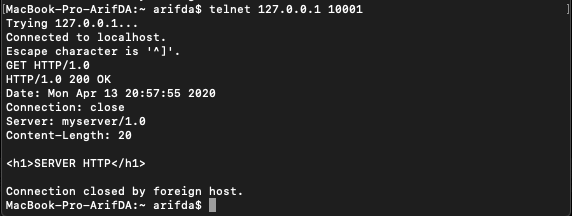
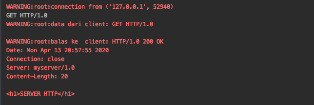

# Tugas 6

- Buka terminal lalu tulis command telnet pada port 10001 dan mengirimkan string `GET / HTTP/1.0`  

Maka respon dari servernya adalah :

- Bukalah chrome web browser bukalah alamat `http://127.0.0.1:10001`  

Respons dari server :

