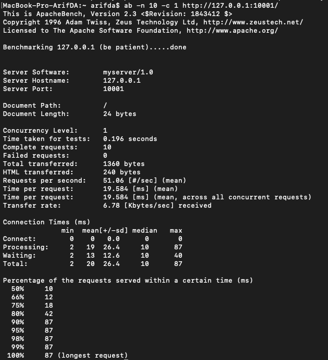
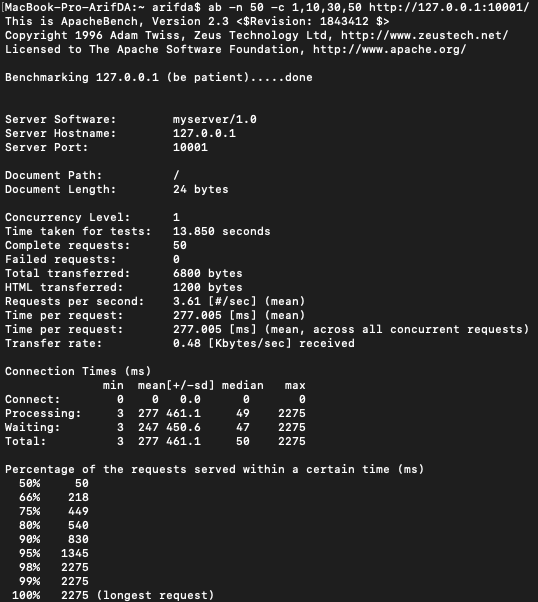
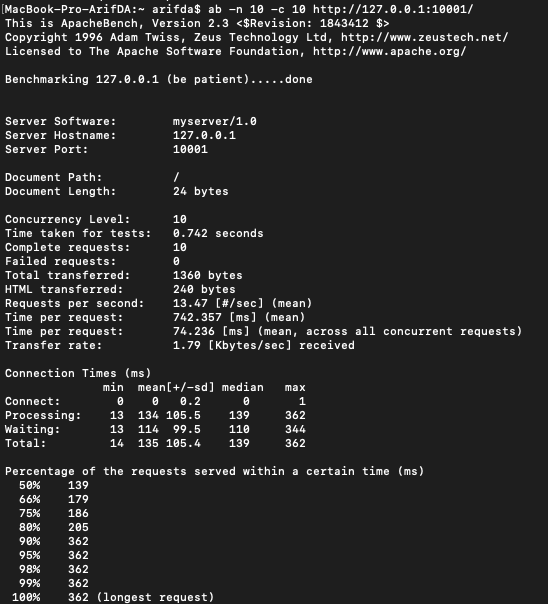
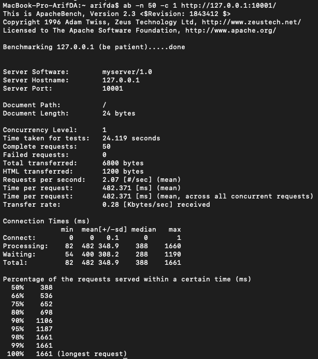

# Tugas 7

## Performance Test

[Server yang ditest](../tugas6/server_thread_http.py)

### Keluaran Hasil

| No test | Concurrency level | Time taken for test (seconds) | Complete request | Failed request | Total transferred (bytes) | Request per second | Time per request (ms) | Transfer rate (Kbytes/sec) |
|:-------:|:-----------------:|:-----------------------------:|:----------------:|:--------------:|:-------------------------:|:------------------:|:---------------------:|:--------------------------:|
|    1    |         1         |             0.196             |        10        |        0       |            1360           |       51.06       |         19.584         |            6.78           |
|    2    |         5         |             0.191             |        10        |        0       |            1360           |        52.32       |         95.558        |            6.95            |
|    3    |         10         |             0.742             |        10       |        0       |           1360           |        13.47       |         742.357        |            1.79            |
|    4    |         1         |             24.119             |        50       |        0       |           6800           |        2.07       |         482.371        |            0.28            |

### Screenshot

- `ab -n 10 -c 1 http://127.0.0.1:10001/`  

- `ab -n 10 -c 5 http://127.0.0.1:10001/`  

- `ab -n 10 -c 10 http://127.0.0.1:10001/`  

- `ab -n 50 -c 1 http://127.0.0.1:10001/`  

