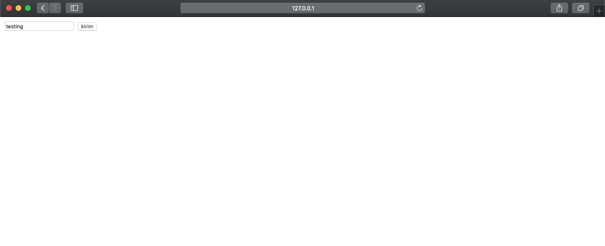
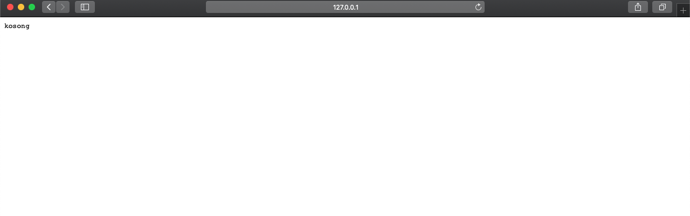
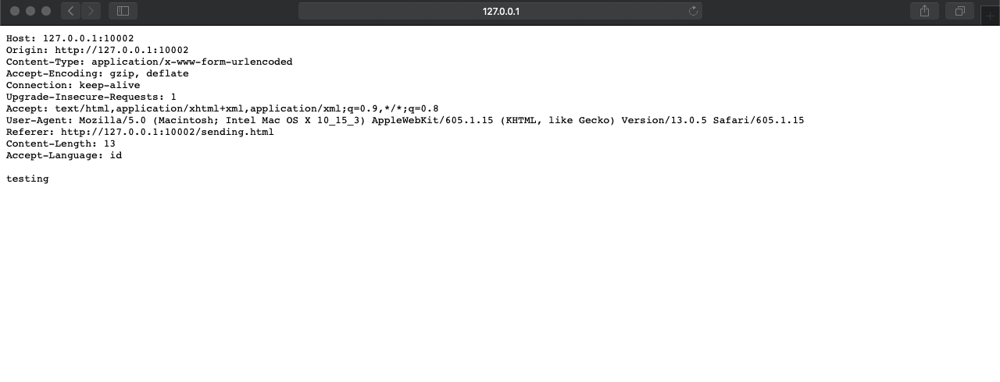
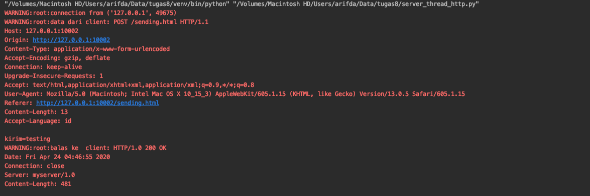
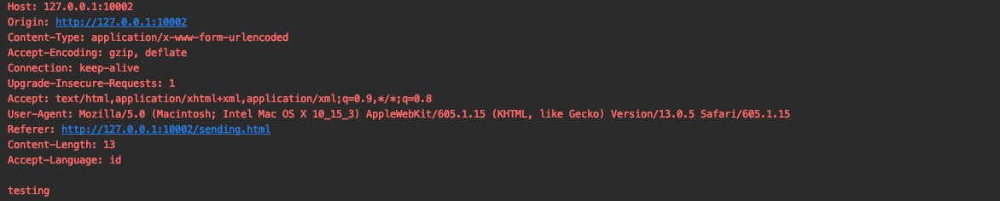

# Tugas 8

- Modifikasilah agar server dapat membalas dengan isi
  - semua header yang dikirim dari browser
  - Yang anda isikan di form pada saat mengisi pada poin nomor 5, misalkan mengisi “ISILAH” maka server akan mereply dengan “ISILAH” juga , dan bukan ‘kosong’
- Buka browser, lalu buka url `http://127.0.0.1:10002/sending.html`, isilah inputan dengan sesuatu dan kirim  
  
Keluaran:
 
- Hasil Modifikasi  
 
Keluaran:
  
Respons server:
  
  
