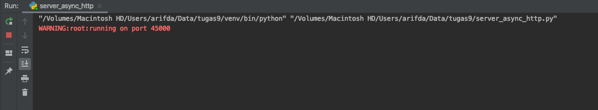
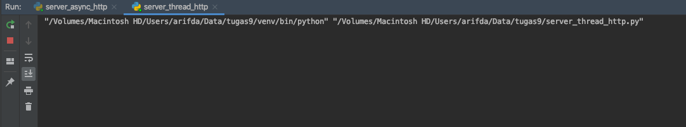
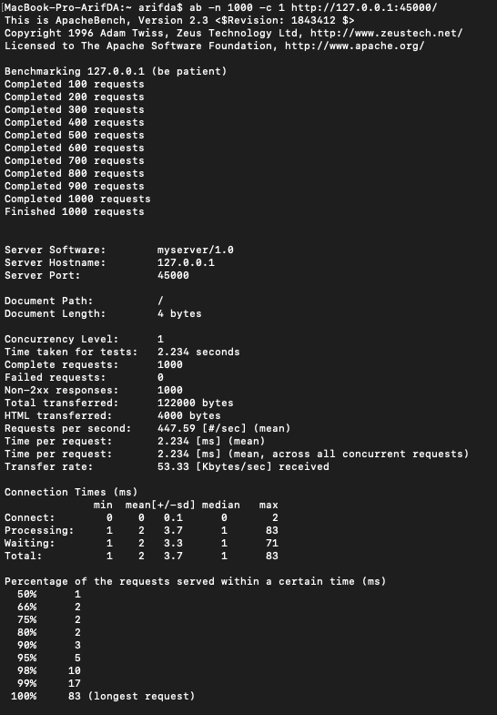
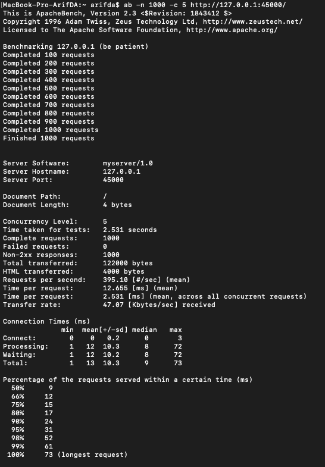
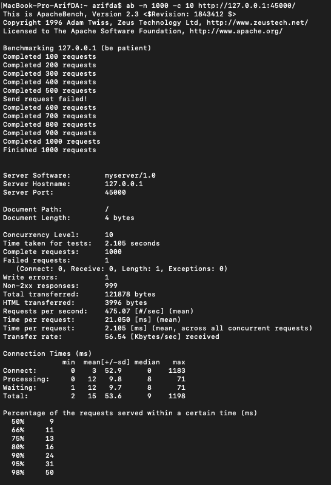
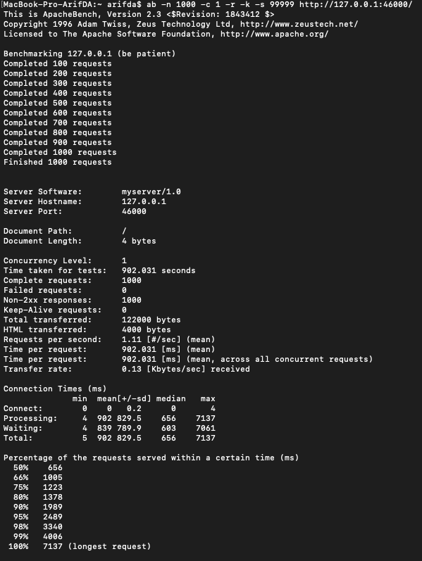
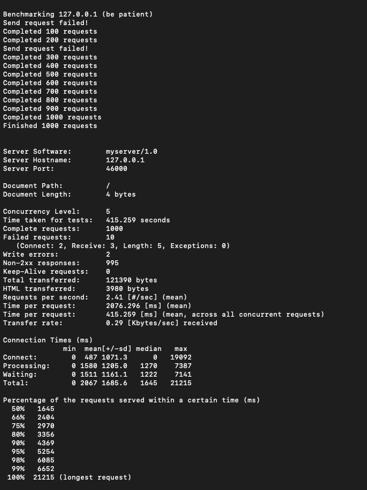

# Tugas 9

- Jalankan kedua model
  - `Server_async_http.py` di port 45000
  - `Server_thread_http.py` di port 46000
  
  

- Ujicobalah dengan apache benchmark untuk 1000 request dan konkurensi yang bervariasi  
  - Server Async
  
  
  
  - Thread Server
  
  
- Tabel hasil ujicoba
  - [Server_async_http.py](../tugas9/server_async_http.py)  
    | No test | Concurrency level | Time taken for test (seconds) | Complete request | Failed request | Total transferred (bytes) | Request per second | Time per request (ms) | Transfer rate (Kbytes/sec) |
    |---------|-------------------|-------------------------------|------------------|----------------|---------------------------|--------------------|-----------------------|----------------------------|
    | 1       | 1                 | 2.234                         | 1000             | 0              | 122000                    | 447.59            | 2.234                 | 53.33                     |
    | 2       | 5                 | 2.531                         | 1000             | 0              | 122000                    | 395.10            | 12.655                 | 47.07                     |
    | 3       | 10                | 2.105                         | 1000             | 1              | 121878                    | 475.07            | 21.050                 | 56.54                     |
  - [Server_thread_http.py](../tugas9/server_thread_http.py)  
    | No test | Concurrency level | Time taken for test (seconds) | Complete request | Failed request | Total transferred (bytes) | Request per second | Time per request (ms) | Transfer rate (Kbytes/sec) |
    |---------|-------------------|-------------------------------|------------------|----------------|---------------------------|--------------------|-----------------------|----------------------------|
    | 1       | 1                 | 902.031                       | 1000             | 0              | 122000                    | 1.11               | 902.031               | 0.13                       |
    | 2       | 5                 | 415.259                       | 1000             | 10              | 121390                    | 2.41               | 2076.296               | 0.29                       |
